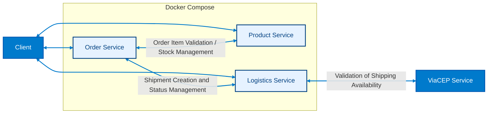

# ShopBridge System Orchestration Repository  

This repository serves as the **orchestration layer** for the ShopBridge microservices ecosystem, developed as part of the **MVP project for the Third Sprint of the Full Stack Development postgraduate program at CCEC - PUC-Rio**. It provides a **structured framework** for local development, **integration testing**, and coordinated execution of the microservices architecture, ensuring that all services operate cohesively within a unified environment.  

The system orchestrates the following RESTful API services:  

- **Order Service** – Manages orders and customer addresses  
- **Logistics Service** – Handles shipment creation, status tracking, and delivery operations  
- **Product Service** – Manages products, product variants, and product reviews  

Each microservice resides in its **own GitHub repository**, enabling independent development, testing, and versioning. The orchestration repository integrates these services via **Docker Compose**, providing a **reliable, reproducible, and isolated runtime environment** that closely mirrors production. This centralized coordination simplifies **dependency management, network configuration, and lifecycle orchestration**, while maintaining a **clear separation of concerns** between individual service logic and system-level operations.  

## Repository Structure  

The `shopbridge_system-orchestration/` repository provides a **single point of control** for the microservices ecosystem, ensuring consistent runtime behavior and seamless integration.  


```
shopbridge_system-orchestration/
│
├── docker-compose.yml       # Defines all services and their runtime configuration
├── .gitignore               # Git ignore rules
├── .gitmodules              # Git submodule references
├── services/                # Git submodules linking to the microservice repositories
│   ├── shopbridge_order/
│   ├── shopbridge_logistics/
│   └── shopbridge_product/
└── docs/
    └── README.md            # Documentation entry point
```

The `services/` directory does **not contain original code**, but acts as a **pointer to each microservice repository**, keeping codebases **isolated, maintainable, and independently versioned**. **Docker volumes** persist SQLite databases, ensuring **data durability across container lifecycles** while supporting lightweight local development. This structure enables **reproducible builds**, **simplified orchestration**, and a **clear separation of responsibilities** between service implementation and system coordination.

---  

## System Architecture Overview



The **ShopBridge system** is designed as a **modular microservices architecture** to manage the full lifecycle of **customer orders** in an **e-commerce context**.

The **Order Service** is the **core component** responsible for **capturing customer orders**, **validating order items**, **managing order status**, and **persisting the order aggregate**. It communicates directly with the **Product Service**, which maintains the **product catalog**, **stock levels**, and **inventory operations**, ensuring that **product availability** is accurate and up to date.

Simultaneously, the **Order Service** coordinates with the **Logistics Service**, which handles **shipment creation**, **status tracking**, and **delivery operations**. External dependencies, such as the **ViaCEP Service**, are utilized by the Logistics Service to **validate addresses** and ensure **shipping feasibility**.

By grouping the **internal services** in a visually distinct **subgraph**, the diagram highlights the **encapsulated nature** of ShopBridge’s services while clearly distinguishing **client interactions** and **external integrations**. This design ensures **scalability**, **maintainability**, and **clear separation of responsibilities** among services.

---

## Service Overview

| Service           | Language | Framework     | Database | Port | Responsibilities                                         |
|------------------|----------|--------------|---------|------|----------------------------------------------------------|
| **Order Service**     | Python   | FastAPI      | SQLite  | 3000 | Manages orders and addresses                             |
| **Product Service**   | C#       | ASP.NET Core | SQLite  | 5000 | Manages products, product variants, and product reviews |
| **Logistics Service** | C#       | ASP.NET Core | SQLite  | 8000 | Manages shipments                                        |

Each service runs independently in its **own container**, with isolated runtime environments and clearly defined responsibilities. Communication between services occurs over **internal Docker networking**, ensuring secure, reliable, and low-latency interactions. This architecture enables **horizontal scalability**, allows each service to evolve independently, and supports robust **integration testing** within the orchestration layer. By containerizing each service, the system guarantees consistent behavior across **development, testing, and production environments**, while also simplifying deployment, updates, and rollback procedures.

---

## Getting Started

### 1. Clone the repository
```bash
git clone https://github.com/mattsimoessilva/shopbridge_system-orchestration.git
cd shopbridge_system-orchestration
```
This command creates a local copy of the orchestration repository on your machine. By navigating into the repository directory, you prepare your environment for initializing submodules, building containers, and running the ShopBridge system.
### 2. Initialize submodules
```bash
git submodule update --init --recursive
```
This command fetches the code from each microservice repository into the services/ directory, ensuring the orchestration layer has all dependencies correctly linked.
### 3. Launch the system
```bash
docker-compose up --build
```
This command builds and starts all three services (Order Service, Logistics Service, Product Service) in separate containers. Local SQLite databases are automatically created or mounted via Docker volumes, providing a fully integrated environment for development, testing, and debugging.

### 4. Verify service availability

Order Service → ```http://localhost:3000```

Logistics Service → ```http://localhost:8000```

Product Service → ```http://localhost:5000```

Swagger documentation is available for each service via:
- **/swagger** for Product and Logistics Service and **/swagger-ui** for Order Service.
---

## Notes

- Each microservice maintains independence and can continue development within its own repository.  
- Updates to a microservice are integrated into this orchestration repository by **updating the respective submodule reference**.  
- SQLite databases are persisted via Docker volumes, guaranteeing data availability across container restarts.  

---  

## References

[1] S. Newman, *Building Microservices: Designing Fine-Grained Systems*. O’Reilly Media, 2015.  
